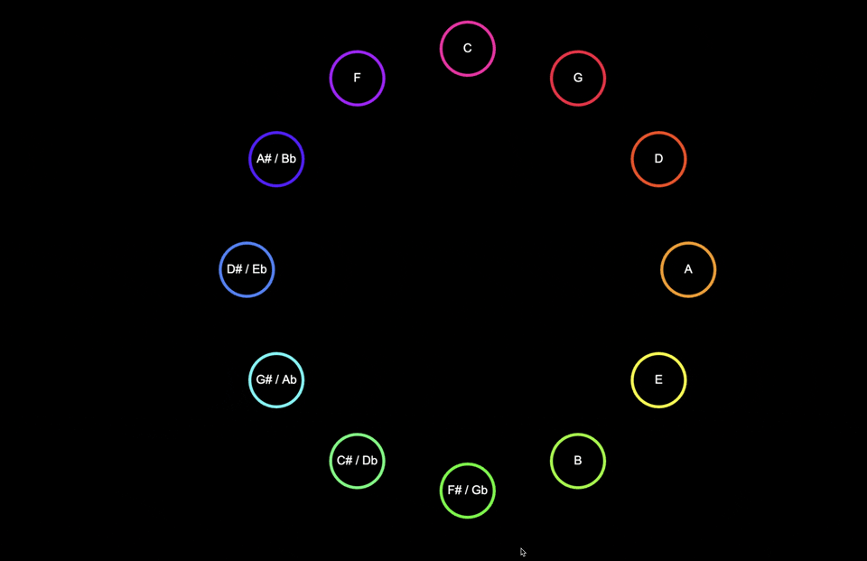

# Fifths
An experiment into simulating [chromesthesia][chromesthesia].

Reads piano playing (through standard keyboard or MIDI instrument) and displays the musical notes in their corresponding colours inside a circle of fifths. Multiple notes simultaneously (i.e. chords) colours are mixed and their area in the circle highlighted.

This was born out of:
1. Curiosity in the topic of colours (mainly after once watching ["Light, Darkness And Colours (1998)"][light_darkness_and_colours], old random film but totally recommend it.)
2. Envy of people with [perfect pitch][perfect_pitch].

## 

## Run

* Clone repo.
* Connect MIDI device.
* Run with:
```
# Install dependencies. (This is only needed once)
npm install

# Launch app.
npm run start
```
* On a Chromium-based browser (note: Safari does NOT support MIDI) navigate to URL displayed by above command.


[chromesthesia]: https://en.wikipedia.org/wiki/Chromesthesia#:~:text=Chromesthesia%20or%20sound%2Dto%2Dcolor,associations%2Fperceptions%20in%20daily%20life
[light_darkness_and_colours]: https://www.youtube.com/watch?v=2hvprCbk1HU
[perfect_pitch]: https://en.wikipedia.org/wiki/Absolute_pitch

# See also

For a *much* more mature project in the same space do check out https://chromatone.center/. In hindsight, I should have (again!) first made the effort to find this project and would have saved me coding this garbage.
